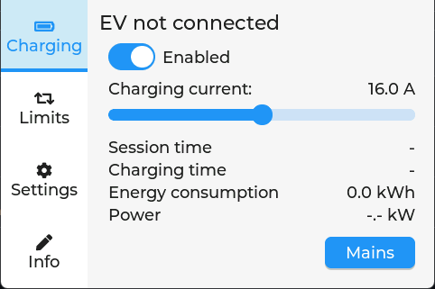
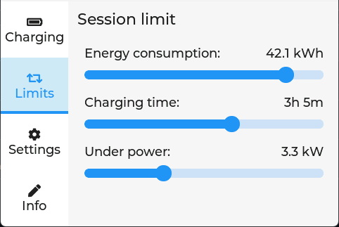
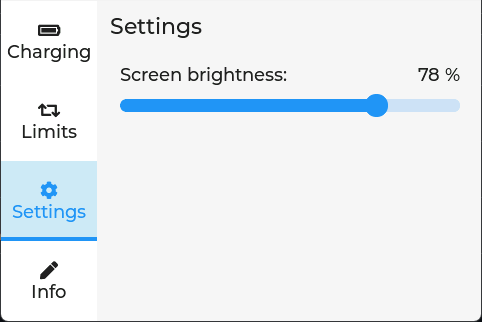
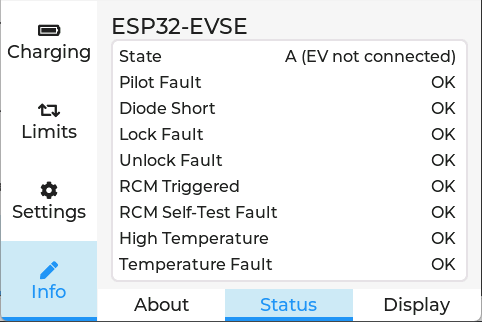
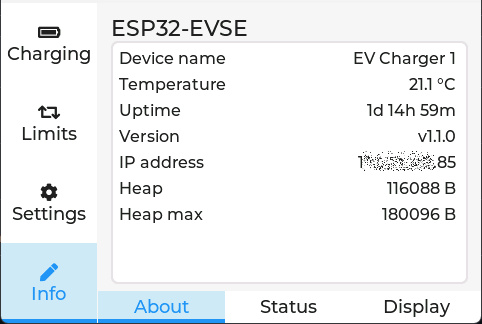
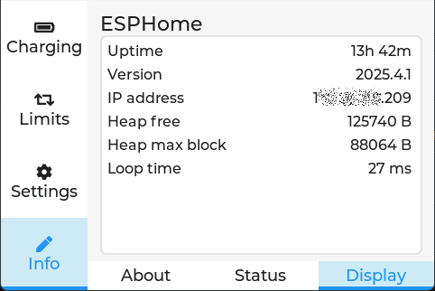

# esp32-evse_esphome-lvgl
HMI for ESP32-EVSE based on ESPHome and LVGL

This is a replacement Human-Machine Interface for the Nextion screen for the excellent [ESP32-EVSE project by Miroslav Dzúrik](https://github.com/dzurikmiroslav/esp32-evse).
It is a plug and play replacement, as it relies on the original Nextion protocol implemented by the author. _Note:_ It doesn't implement the entire Nextion protocol, just the subset required by the EVSE.

ESPHome [supports](https://esphome.io/components/lvgl/) LVGL graphics library. Using ESPHome as a framework instead of trying to implement LVGL natively has the advantage that besides making it a lot more simpler to configure, it brings in all the modularity of the ecosystem: 
- any useful graphical UI can be rendered via LVGL, with fully open source resources (no proprietary editor needed), just edit a YAML file
- multiple UARTs can be configured (eg one talking to `esp32-evse`, other talking to smart meter or inverter etc.)
- can use free GPIOs or the display for anything else, like garage door openers, RF transmitters, RFiD readers for authorization etc.
- can connect to Home Assistant via native API (or MQTT to other systems), can expose any chosen EVSE sensors and controls to it
- has Bluetooth and with it you could pair with your car and implement additional related features (eg open charging flap automatically, poll battery status, temperature, etc., which wouldn't have to interfere with EVSE board at all)
- easier to make own Dynamic Load Management through HA or other ESPHome components (eg use data from other meters in various ways; freely implement DLM logic either in HA or in ESPHome based on any available data soruces)

The device consists of any graphical display with touch screen supported by [ESPHome](https://esphome.io/components/#display-hardware-platforms). The example file _esp32-evse_esphome-lvgl_display.yaml_ contains working configuration for the Guition JC3248w535 display, which can be connected directly to ESP32-EVSE board, from the 4-pin JST 1.24 connector located near to the USB-C socket. The pins are 5V, TX and RX at 3.3v and GND.
What makes this a good choice is:
- has a pretty nice case that can be mounted on a box which has `esp32-evse` inside
- has resolution of 480*320
- has capacitive touch screen
- it runs an ESP32-S3
- has a considerable number of additional free GPIOs
- way less expensive than Nextion

 
 
 

